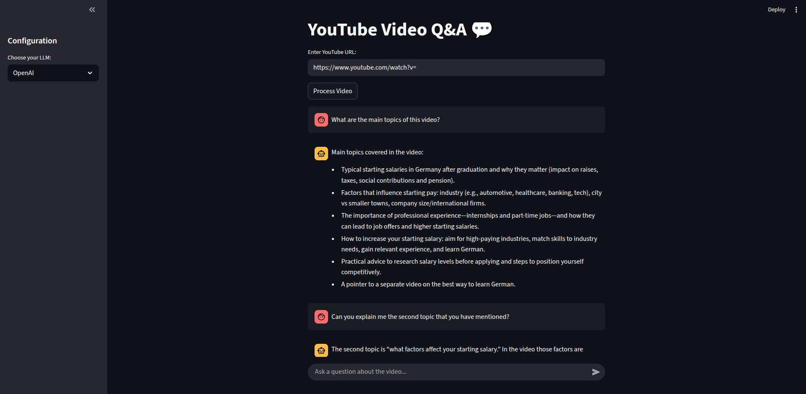

```markdown
# YouTube Video Q&A with Local & OpenAI LLMs

[](https://www.python.org/)
[](https://opensource.org/licenses/MIT)

An intelligent application that transforms any YouTube video into a conversational chatbot. You can ask questions about the video's content and get answers generated by either a powerful, private local LLM (via Ollama) or the OpenAI API.

## Key Features

-   **YouTube Video Processing**: Simply provide a YouTube URL to download the video's audio.
-   **Speech-to-Text**: Utilizes OpenAI's Whisper model for highly accurate audio transcription.
-   **Dual LLM Support**: Seamlessly switch between a local model (e.g., Llama 3) via Ollama and an OpenAI model (e.g., GPT-5-Mini).
-   **Conversational Memory**: The chatbot remembers the context of your conversation, allowing for natural follow-up questions.
-   **Source Citing**: Shows you which parts of the video transcript were used to generate the answer.
-   **Interactive UI**: A user-friendly web interface built with Streamlit.

## Demo



## Tech Stack & Architecture

This project uses the Retrieval-Augmented Generation (RAG) architecture.

1.  **Data Ingestion**: Audio is downloaded from YouTube (`pytubefix`) and transcribed to text (`openai-whisper`).
2.  **Indexing**: The transcript is split into chunks and stored in a `FAISS` vector store using `LangChain`.
3.  **Retrieval & Generation**: When a user asks a question, the system retrieves relevant chunks from the vector store and feeds them, along with the chat history, to the selected LLM (`Ollama` or `OpenAI`) to generate a context-aware answer.

-   **Frontend**: Streamlit
-   **AI/Orchestration**: LangChain
-   **Local LLM Hosting**: Ollama
-   **Transcription**: openai-whisper
-   **Vector Store**: FAISS
-   **YouTube Downloader**: pytubefix

## Setup and Installation

Follow these steps to set up and run the project on your local machine.

### Prerequisites

-   [Python 3.9+](https://www.python.org/downloads/)
-   [Git](https://git-scm.com/downloads)
-   **FFmpeg**: Whisper requires FFmpeg. Install it for your OS:
    -   **macOS**: `brew install ffmpeg`
    -   **Ubuntu/Debian**: `sudo apt update && sudo apt install ffmpeg`
    -   **Windows**: Follow the instructions at [ffmpeg.org](https://ffmpeg.org/download.html).
-   **Ollama**: To run local models, download and install Ollama from [ollama.com](https://ollama.com/).

### Installation Steps

1.  **Clone the repository:**
    ```bash
    git clone https://github.com/avcibatuhan/rag-youtube-video-chatting.git
    cd rag-youtube-video-chatting
    ```

2.  **Create a Python virtual environment:**
    ```bash
    python -m venv .venv
    source .venv/bin/activate  # On Windows, use: .venv\Scripts\activate
    ```

3.  **Install the required dependencies:**
    ```bash
    pip install -r requirements.txt
    ```

4.  **Set up Ollama:**
    Pull a model to use locally. Llama 3 is a great starting point.
    ```bash
    ollama run llama3
    ```

5.  **Set up Environment Variables (Optional):**
    If you plan to use the OpenAI model, you will need an API key. It's recommended to create a `.env` file in the root directory to store your key.

    Create a file named `.env` and add the following line:
    ```
    OPENAI_API_KEY="your-api-key-here"
    ```

## How to Run the Application

Once the installation is complete, you can run the Streamlit application with the following command:

```bash
streamlit run app.py
```

Open your web browser and navigate to the local URL provided by Streamlit (usually `http://localhost:8501`).

## Project Structure

```.
├── app.py                 # The main Streamlit frontend application
├── rag.py                 # Backend logic for the RAG pipeline
├── requirements.txt       # List of Python dependencies
├── .gitignore             # Files and directories to be ignored by Git
└── README.md              # You are here
```

## Future Enhancements

-   **Containerization**: Package the application with Docker for easy deployment.
-   **Advanced RAG**: Implement a re-ranking step to improve the quality of retrieved context.
-   **Persistence**: Add caching for processed videos using a database like ChromaDB to avoid reprocessing.
-   **Multimodality**: Analyze video frames to answer questions about visual content.
